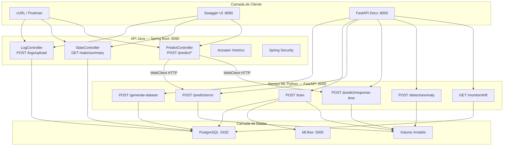
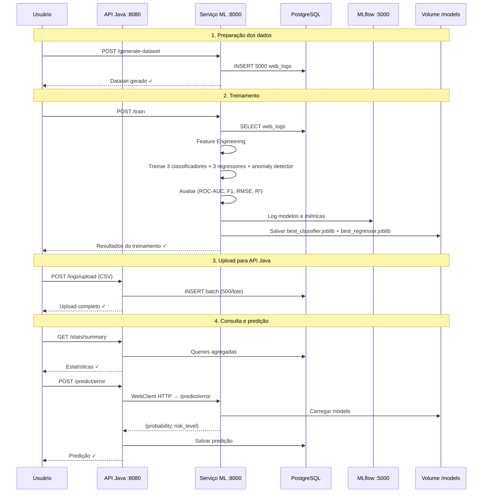

# 🔮 Predictive Log Intelligence Platform — Documentação Técnica

## 1. Visão Geral

A **Predictive Log Intelligence Platform (PLIP)** é um sistema distribuído de nível enterprise para **ingestão de logs web, análise estatística descritiva e detecção preditiva de anomalias** usando Machine Learning.

O sistema ingere logs de requisições HTTP (método, path, status code, tempo de resposta, IP, user-agent), treina modelos de classificação e regressão sobre esses dados e expõe endpoints de inferência em tempo real para:

- **Prever a probabilidade de erro** (status ≥ 400) de uma requisição futura.
- **Estimar o tempo de resposta** esperado para uma configuração de requisição.
- **Detectar anomalias** em tempo de resposta usando técnicas estatísticas e ML.
- **Monitorar drift de dados** entre os dados de produção e os dados de treinamento.

---

## 2. Arquitetura do Sistema



### Comunicação entre serviços

| De | Para | Protocolo | Descrição |
|---|---|---|---|
| Java API | Python ML | HTTP (WebClient reativo) | Encaminha predições de erro e tempo de resposta |
| Python ML | PostgreSQL | SQLAlchemy (psycopg2) | Lê logs para treinamento e geração de dataset |
| Java API | PostgreSQL | JPA/Hibernate | CRUD de logs, predições e estatísticas |
| Python ML | MLflow | MLflow Client SDK | Registra modelos, métricas e artefatos |
| Ambos | Volume /models | Filesystem compartilhado | Persistência de `.joblib` dos melhores modelos |

---

## 3. Stack Tecnológica

### 3.1 Serviço ML Python (porta 8000)

| Tecnologia | Versão | Papel |
|---|---|---|
| **Python** | 3.12 | Runtime |
| **FastAPI** | ≥ 0.110 | Framework web assíncrono (ASGI) |
| **Uvicorn** | ≥ 0.27 | Servidor ASGI de alta performance |
| **scikit-learn** | ≥ 1.4 | Modelos de ML (Logistic Regression, Random Forest, Isolation Forest) |
| **XGBoost** | ≥ 2.0 | Classificador gradient boosting otimizado |
| **pandas** | ≥ 2.2 | Manipulação de DataFrames e feature engineering |
| **NumPy** | ≥ 1.26 | Operações numéricas vetorizadas |
| **SciPy** | ≥ 1.12 | Testes estatísticos (Z-score, Kolmogorov-Smirnov) |
| **MLflow** | ≥ 2.11 | Rastreamento de experimentos e versionamento de modelos |
| **Evidently AI** | ≥ 0.4 | Monitoramento de drift de dados |
| **SHAP** | ≥ 0.45 | Explicabilidade de modelos (SHapley Additive exPlanations) |
| **Matplotlib** | ≥ 3.8 | Geração de gráficos (ROC, Confusion Matrix, Feature Importance) |
| **joblib** | ≥ 1.3 | Serialização eficiente de modelos treinados |
| **SQLAlchemy** | ≥ 2.0 | ORM para acesso ao PostgreSQL |
| **psycopg2** | ≥ 2.9 | Driver nativo PostgreSQL |

### 3.2 API Java (porta 8080)

| Tecnologia | Versão | Papel |
|---|---|---|
| **Java** | 21 (LTS) | Runtime |
| **Spring Boot** | 3.2.3 | Framework principal |
| **Spring Web** | — | Controladores REST |
| **Spring Data JPA** | — | Repositórios e acesso a dados via Hibernate 6.4 |
| **Spring Security** | — | Autenticação e CORS (stateless, sem sessão) |
| **Spring WebFlux (WebClient)** | — | Cliente HTTP reativo para comunicação com o serviço ML |
| **Spring Actuator** | — | Health checks, métricas e endpoints de monitoramento |
| **Micrometer + Prometheus** | — | Coleta e exportação de métricas customizadas |
| **SpringDoc OpenAPI** | 2.3.0 | Swagger UI e documentação automática da API |
| **Lombok** | — | Redução de boilerplate (Builders, Getters, Loggers) |
| **OpenCSV** | 5.9 | Parser de arquivos CSV |
| **PostgreSQL Driver** | — | Conectividade JDBC com PostgreSQL |
| **JaCoCo** | 0.8.11 | Relatórios de cobertura de testes |
| **Testcontainers** | 1.19.5 | Testes de integração com containers Docker |

### 3.3 Infraestrutura

| Tecnologia | Papel |
|---|---|
| **Docker** | Containerização de todos os serviços |
| **Docker Compose** | Orquestração local multi-container |
| **PostgreSQL 16 Alpine** | Banco de dados relacional |
| **MLflow Server** | UI de rastreamento de experimentos (SQLite backend) |

---

## 4. Pipeline de Machine Learning — Detalhamento Técnico

### 4.1 Geração de Dataset Sintético

O módulo `dataset_generator.py` produz **5.000 registros** de logs web com padrões realistas:

- **Timestamps**: distribuídos ao longo de 30 dias.
- **Métodos HTTP**: GET (55%), POST (25%), PUT (10%), DELETE (5%), PATCH (5%).
- **Status codes**: probabilidade de erro **correlacionada com hora** — picos durante horário comercial (9h-12h e 14h-18h) e para métodos mutáveis (POST/PUT/DELETE).
- **Tempos de resposta**: modelados por distribuição normal com variância dependente do horário e do status code. Erros 5xx têm base ~800ms; sucesso ~200ms; pico horário multiplica por 1.5×.
- **Outliers intencionais**: 2% dos registros recebem tempos extremos (3-15 segundos) para treinar o detector de anomalias.

### 4.2 Feature Engineering

O módulo `feature_engineering.py` transforma os logs brutos em features numéricas:

| Feature | Tipo | Descrição |
|---|---|---|
| `hour` | Temporal | Hora do dia (0–23) |
| `day_of_week` | Temporal | Dia da semana (0=Segunda, 6=Domingo) |
| `is_business_hours` | Binária | 1 se 8h–18h em dia útil |
| `method_*` | One-hot | Encoding do método HTTP (GET, POST, PUT, DELETE, PATCH) |
| `rolling_avg_response` | Média móvel | Média de `response_time_ms` com janela de 50 registros |
| `hourly_frequency` | Contagem | Frequência acumulada de registros por hora |
| `is_error` | Target (classificação) | 1 se `status_code` ≥ 400 |

### 4.3 Modelos de Classificação (Predição de Erro)

A classe `ClassifierPipeline` treina 3 modelos em paralelo e seleciona o melhor por **ROC-AUC**:

| Modelo | Hiperparâmetros chave | Observações |
|---|---|---|
| **Logistic Regression** | `max_iter=1000`, `class_weight=balanced` | Baseline linear, bom para interpretabilidade |
| **Random Forest** | `n_estimators=200`, `max_depth=10`, `class_weight=balanced` | Ensemble de árvores, captura não-linearidades |
| **XGBoost** | `n_estimators=200`, `max_depth=6`, `lr=0.1`, `scale_pos_weight=5.0` | Gradient boosting otimizado, geralmente o melhor |

**Métricas avaliadas**: ROC-AUC, F1-score (weighted), Accuracy, Confusion Matrix, curvas Precision-Recall.

**Saída da predição**: probabilidade de erro + nível de risco (`LOW` < 15%, `MEDIUM` < 40%, `HIGH` < 70%, `CRITICAL` ≥ 70%).

### 4.4 Modelos de Regressão (Predição de Tempo de Resposta)

A classe `RegressorPipeline` treina 3 modelos e seleciona o melhor por **R²**:

| Modelo | Hiperparâmetros chave |
|---|---|
| **Linear Regression** | Padrão (baseline) |
| **Random Forest Regressor** | `n_estimators=200`, `max_depth=12` |
| **Gradient Boosting Regressor** | `n_estimators=200`, `max_depth=6`, `lr=0.1` |

**Métricas avaliadas**: RMSE, MAE, R².

**Saída da predição**: tempo estimado em ms + intervalo de confiança de 95% (±1.96 × RMSE).

### 4.5 Detecção de Anomalias

A classe `AnomalyDetector` combina duas técnicas:

1. **Z-score estatístico**: calcula o desvio padrão do `response_time_ms` em relação à distribuição de treinamento. Threshold = 3.0 (≈ 99.7% de confiança).
2. **Isolation Forest**: modelo de ensemble não-supervisionado com `contamination=0.05` (assume 5% de anomalias). Isola pontos anômalos usando partições aleatórias de features.

**Decisão combinada**: um ponto é anômalo se **qualquer** método o detectar. O score final é a média normalizada dos dois métodos.

### 4.6 Monitoramento de Drift

O módulo `drift.py` usa **Evidently AI** para detectar mudanças estatísticas entre os dados de referência (treinamento) e dados de produção:

- **Preset**: `DataDriftPreset` — analisa distribuições de todas as features numéricas.
- **Saída**: relatório HTML + JSON com drift por coluna (`drift_detected`, `drift_score`, `stattest_name`).
- **Fallback**: teste Kolmogorov-Smirnov manual (SciPy) quando Evidently não está disponível.
- **Threshold de dataset drift**: >50% das colunas com drift individual → drift global detectado.

### 4.7 Versionamento de Modelos (MLflow)

Todos os modelos treinados são registrados no **MLflow Tracking Server**:

- Cada modelo gera um **run** separado com parâmetros, métricas e artefatos.
- Modelos sklearn são logados via `mlflow.sklearn.log_model()`.
- Modelos XGBoost via `mlflow.xgboost.log_model()`.
- O melhor modelo é salvo em `.joblib` no volume compartilhado `/models`.

---

## 5. Banco de Dados — Schema PostgreSQL

```sql
-- Logs web ingeridos
web_logs (id, timestamp, method, path, status_code, response_time_ms,
          user_agent, ip_address, bytes_sent, created_at)

-- Histórico de predições
predictions (id, prediction_type, input_data JSONB, result JSONB,
             model_version, latency_ms, created_at)

-- Metadados dos modelos
model_metadata (id, model_name, model_type, version, metrics JSONB,
                file_path, is_active, trained_at, created_at)

-- Histórico de treinamentos
training_runs (id, run_id, status, num_samples, best_classifier,
               best_regressor, classifier_metrics JSONB,
               regressor_metrics JSONB, started_at, completed_at)
```

Índices criados em: `timestamp`, `status_code`, `method`, `prediction_type`, `created_at`, `is_active`, `status`.

---

## 6. Endpoints da Aplicação

### 6.1 API Java (http://localhost:8080)

| Método | Endpoint | Descrição | Controller |
|---|---|---|---|
| `POST` | `/logs/upload` | Upload de CSV de logs web | `LogController` |
| `GET` | `/stats/summary` | Estatísticas descritivas (média, mediana, σ, P95, taxa de erro, hora pico) | `StatsController` |
| `POST` | `/predict/error` | Prever probabilidade de erro HTTP | `PredictController` |
| `POST` | `/predict/response-time` | Prever tempo de resposta em ms | `PredictController` |
| `GET` | `/actuator/health` | Health check (Spring Actuator) | Actuator |
| `GET` | `/actuator/metrics` | Métricas de Performance | Actuator |
| `GET` | `/actuator/prometheus` | Métricas no formato Prometheus | Actuator |
| `GET` | `/swagger-ui.html` | Documentação interativa (Swagger UI) | SpringDoc |

**Swagger UI**: http://localhost:8080/swagger-ui.html

### 6.2 Serviço ML Python (http://localhost:8000)

| Método | Endpoint | Descrição | Router |
|---|---|---|---|
| `POST` | `/generate-dataset` | Gerar 5000 registros sintéticos e salvar no PostgreSQL | `train.py` |
| `POST` | `/train` | Treinar todos os modelos (classificação + regressão + anomalia) | `train.py` |
| `POST` | `/predict/error` | Prever probabilidade de erro (usa melhor classificador) | `predict.py` |
| `POST` | `/predict/response-time` | Prever tempo de resposta (usa melhor regressor) | `predict.py` |
| `POST` | `/detect/anomaly` | Detectar anomalia via Z-score + Isolation Forest | `anomaly.py` |
| `GET` | `/monitor/drift` | Relatório de drift dos dados (Evidently AI) | `monitor.py` |
| `GET` | `/monitor/health` | Status dos modelos carregados | `monitor.py` |
| `GET` | `/health` | Health check simples | `main.py` |

**FastAPI Docs**: http://localhost:8000/docs

### 6.3 MLflow (http://localhost:5000)

Interface web para rastreamento de experimentos, comparação de modelos e visualização de métricas/artefatos.

**MLflow UI**: http://localhost:5000

---

## 7. Observabilidade e Monitoramento

### Métricas customizadas (Micrometer)

| Métrica | Tipo | Descrição |
|---|---|---|
| `ml.inference.latency` | Timer | Latência de chamadas ao serviço ML (ms) |
| `ml.predictions.total` | Counter | Total de predições realizadas |
| `ml.predictions.errors` | Counter | Total de erros nas predições |

### Endpoints de monitoramento

- **Health Check**: `GET /actuator/health` — status de BD, disco e ping.
- **Métricas**: `GET /actuator/metrics/{metricName}` — métricas individuais.
- **Prometheus**: `GET /actuator/prometheus` — exportação no formato Prometheus para Grafana.
- **Drift de dados**: `GET /monitor/drift` — relatório de drift via Evidently AI.

---

## 8. Segurança

- **CSRF desabilitado**: API REST stateless, sem cookies de sessão.
- **CORS**: habilitado para todas as origens (`*`) — adequado para desenvolvimento.
- **Sessão Stateless**: `SessionCreationPolicy.STATELESS` — sem estado no servidor.
- **Endpoints públicos**: `/logs/**`, `/stats/**`, `/predict/**`, `/actuator/**`, `/swagger-ui/**`.
- **Demais endpoints**: exigem autenticação (escopo para OAuth2/JWT futuro).

---

## 9. Fluxo de Execução Completo



---

## 10. Como Executar

```bash
# Iniciar todos os serviços
docker-compose up --build -d

# Verificar status
docker ps --filter "name=plip"

# Gerar dados + treinar modelos + carregar na API
curl -X POST http://localhost:8000/generate-dataset
curl -X POST http://localhost:8000/train
curl -F "file=@data/web_logs.csv" http://localhost:8080/logs/upload

# Testar predição
curl -X POST http://localhost:8080/predict/error \
  -H "Content-Type: application/json" \
  -d '{"method":"GET","hour":14,"historicalAvgResponse":240}'

# Parar todos os serviços
docker-compose down
```
