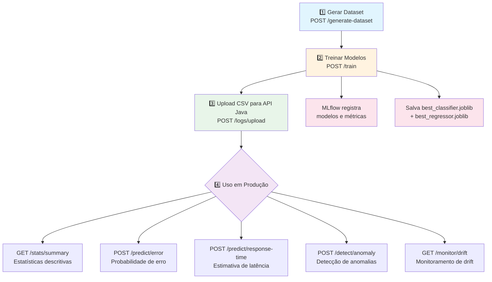
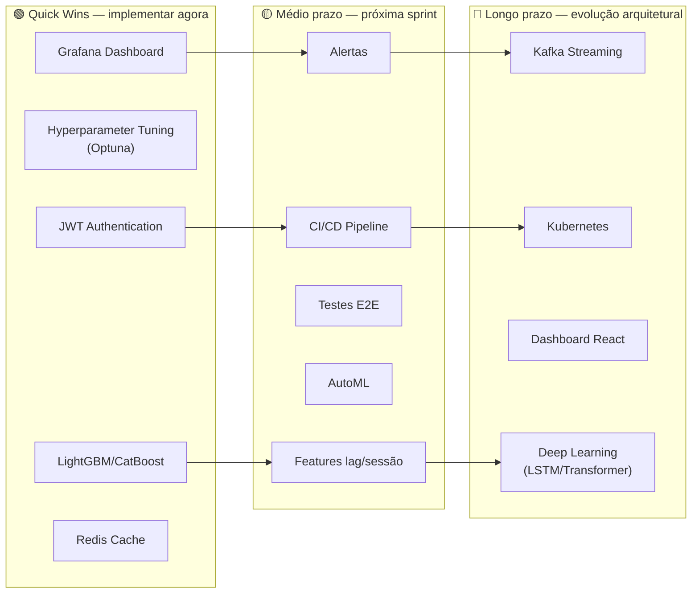

# 🚀 Fluxo da Aplicação e Evoluções Possíveis

## 1. Fluxo Atual da Aplicação



### Detalhamento de cada etapa

| Etapa | O que acontece por baixo dos panos |
|---|---|
| **1. Gerar Dataset** | `dataset_generator.py` cria 5000 registros com distribuições realistas (correlação hora×erro, outliers 2%, variância temporal). Salva CSV em `/data` e insere no PostgreSQL. |
| **2. Treinar Modelos** | Lê `web_logs` do PostgreSQL → Feature Engineering (10 features) → Treina 3 classificadores + 3 regressores + Isolation Forest → Avalia métricas → Registra no MLflow → Salva `.joblib` no volume compartilhado. |
| **3. Upload CSV** | A API Java parseia CSV via OpenCSV, resolve colunas dinamicamente, e persiste em batch de 500 registros via JPA. |
| **4. Predição de Erro** | Java API recebe request → WebClient encaminha ao Python ML → Modelo carrega `.joblib` → `predict_proba()` → Retorna probabilidade + nível de risco → Java salva predição no banco. |
| **5. Predição de Tempo** | Mesmo fluxo, usando o melhor regressor → Retorna tempo estimado + intervalo de confiança 95%. |
| **6. Detecção de Anomalia** | Z-score (threshold=3.0) + Isolation Forest (contamination=5%) → Decisão combinada (OR lógico). |
| **7. Monitoramento de Drift** | Evidently AI compara dados atuais vs. referência de treinamento → Relatório HTML + JSON com drift por feature. |

---

## 2. Como Inserir Novos Modelos de Treinamento

A arquitetura atual **já suporta** a adição de novos modelos com mudanças mínimas. Os pipelines de treinamento usam um padrão de **dicionário de modelos** que torna a extensão trivial:

### 2.1 Adicionar um novo classificador

Editar `python-ml-service/app/models/classifier.py`, método `train_and_evaluate`:

```python
# Código atual — basta adicionar ao dicionário:
classifiers = {
    "logistic_regression": LogisticRegression(...),
    "random_forest": RandomForestClassifier(...),
    "xgboost": XGBClassifier(...),
    
    # ===== NOVOS MODELOS =====
    "lightgbm": LGBMClassifier(
        n_estimators=300, max_depth=8, learning_rate=0.05,
        random_state=42, class_weight="balanced",
    ),
    "catboost": CatBoostClassifier(
        iterations=300, depth=6, learning_rate=0.05,
        random_seed=42, verbose=0,
    ),
    "svm": SVC(
        kernel="rbf", probability=True,
        class_weight="balanced", random_state=42,
    ),
    "neural_net": MLPClassifier(
        hidden_layer_sizes=(128, 64, 32), max_iter=500,
        random_state=42, early_stopping=True,
    ),
}
```

O pipeline automaticamente treina, avalia e compara — o melhor modelo é selecionado pelo ROC-AUC.

### 2.2 Adicionar um novo regressor

Mesmo padrão em `python-ml-service/app/models/regressor.py`:

```python
regressors = {
    "linear_regression": LinearRegression(),
    "random_forest_regressor": RandomForestRegressor(...),
    "gradient_boosting": GradientBoostingRegressor(...),
    
    # ===== NOVOS MODELOS =====
    "lightgbm_regressor": LGBMRegressor(
        n_estimators=300, max_depth=10, learning_rate=0.05,
    ),
    "xgboost_regressor": XGBRegressor(
        n_estimators=300, max_depth=8, learning_rate=0.1,
    ),
    "elastic_net": ElasticNet(alpha=1.0, l1_ratio=0.5),
    "svr": SVR(kernel="rbf", C=100),
}
```

> [!TIP]
> Para LightGBM e CatBoost, basta adicionar `lightgbm` e `catboost` ao `requirements.txt` e ao `Dockerfile`.

---

## 3. Evoluções Possíveis — Roadmap

### 3.1 🧠 Machine Learning

| Evolução | Complexidade | Impacto | Descrição |
|---|---|---|---|
| **LightGBM / CatBoost** | 🟢 Baixa | Alto | Adicionar ao dicionário de modelos (como mostrado acima). Geralmente superam XGBoost em velocidade. |
| **AutoML (FLAML/Auto-sklearn)** | 🟡 Média | Alto | Busca automática de hiperparâmetros e modelos. Substituiria o treinamento manual por otimização automatizada. |
| **Hyperparameter Tuning** | 🟡 Média | Alto | Usar `Optuna` ou `GridSearchCV` para otimizar hiperparâmetros. Atualmente os valores são fixos no código. |
| **Deep Learning (LSTM/Transformer)** | 🔴 Alta | Alto | Modelos de séries temporais para prever padrões de erro ao longo do tempo, usando sequências de logs. |
| **Modelos por endpoint** | 🟡 Média | Alto | Treinar modelos específicos por path (ex: `/api/orders` vs `/api/auth`). Cada endpoint tem padrões distintos. |
| **Ensemble Stacking** | 🟡 Média | Médio | Combinar predições dos 3 classificadores atuais num meta-modelo para melhor performance. |
| **Quantile Regression** | 🟢 Baixa | Médio | Substituir o intervalo de confiança simplificado (±1.96×RMSE) por regressão quantílica real (P5, P50, P95). |
| **Previsão de séries temporais** | 🔴 Alta | Alto | Usar Prophet ou ARIMA para prever volume de requests e erros por hora/dia. |
| **Clustering de logs** | 🟡 Média | Médio | K-Means ou DBSCAN para agrupar padrões de acesso similares e detectar comportamentos incomuns. |

### 3.2 📊 Feature Engineering

| Evolução | Complexidade | Impacto | Descrição |
|---|---|---|---|
| **Features de texto (NLP)** | 🟡 Média | Alto | Extrair features do `path` e `user_agent` via TF-IDF ou embeddings. Atualmente ignorados nos modelos. |
| **Features de IP** | 🟢 Baixa | Médio | IP geolocation, frequência de acesso por IP, detecção de bots. |
| **Features lag** | 🟡 Média | Alto | Lag features (tempo de resposta das últimas N requisições), taxa de erro nos últimos 5 minutos. |
| **Features de sessão** | 🟡 Média | Alto | Agrupar requisições por sessão/IP e calcular métricas de sessão (duração, taxa de erro por sessão). |
| **Target Encoding** | 🟢 Baixa | Médio | Substituir one-hot encoding por target encoding para features categóricas com alta cardinalidade. |

### 3.3 🏗️ Arquitetura e Infraestrutura

| Evolução | Complexidade | Impacto | Descrição |
|---|---|---|---|
| **Kafka/RabbitMQ** | 🔴 Alta | Alto | Substituir ingestão batch (CSV) por streaming em tempo real. Cada log publicado numa fila e consumido assincronamente. |
| **Redis Cache** | 🟡 Média | Alto | Cache de predições para requests similares. Reduz latência e carga no serviço ML. |
| **Kubernetes (K8s)** | 🔴 Alta | Alto | Substituir Docker Compose por K8s para orquestração em escala, auto-scaling e alta disponibilidade. |
| **API Gateway (Kong/Traefik)** | 🟡 Média | Médio | Rate limiting, circuit breaker, load balancing entre instâncias. |
| **CI/CD Pipeline** | 🟡 Média | Alto | GitHub Actions ou Jenkins para build, test e deploy automáticos. |
| **Terraform/IaC** | 🟡 Média | Médio | Infraestrutura como código para deploys em AWS/GCP/Azure. |

### 3.4 🔒 Segurança

| Evolução | Complexidade | Impacto | Descrição |
|---|---|---|---|
| **JWT/OAuth2** | 🟡 Média | Alto | Autenticação via tokens JWT. Atualmente todos os endpoints são públicos. |
| **Rate Limiting** | 🟢 Baixa | Alto | Limitar requests por IP/minuto para prevenir abuso. |
| **HTTPS/TLS** | 🟢 Baixa | Alto | Certificados SSL para tráfego encriptado. |
| **Secrets Management** | 🟢 Baixa | Alto | Usar Docker Secrets ou HashiCorp Vault ao invés de variáveis de ambiente em texto claro. |
| **Audit logging** | 🟡 Média | Médio | Registrar quem fez qual predição e quando, para compliance. |

### 3.5 📈 Observabilidade

| Evolução | Complexidade | Impacto | Descrição |
|---|---|---|---|
| **Grafana Dashboard** | 🟢 Baixa | Alto | Dashboard visual com métricas do Prometheus (latência, volume, taxa de erro, drift). |
| **Alertas (AlertManager)** | 🟡 Média | Alto | Alertas Slack/email quando drift detectado, latência alta, ou taxa de erro aumenta. |
| **ELK Stack** | 🟡 Média | Médio | Centralizar logs dos 4 serviços em Elasticsearch + Kibana. |
| **Distributed Tracing (Jaeger)** | 🟡 Média | Médio | Rastrear requests entre Java API → Python ML para debugging de latência. |
| **Model Performance Dashboard** | 🟡 Média | Alto | Monitorar accuracy/F1 dos modelos em produção ao longo do tempo (concept drift). |

### 3.6 🧪 Testes e Qualidade

| Evolução | Complexidade | Impacto | Descrição |
|---|---|---|---|
| **Testes E2E automatizados** | 🟡 Média | Alto | Pipeline completo: gerar dados → treinar → prever → validar resultado. |
| **Testes de carga (k6/Locust)** | 🟡 Média | Alto | Simular 1000 requests/seg para validar capacidade de throughput. |
| **Contract Testing (Pact)** | 🟡 Média | Médio | Garantir que Java API e Python ML mantêm contratos de API compatíveis. |
| **Testes de modelo (Great Expectations)** | 🟡 Média | Alto | Validar qualidade dos dados e métricas mínimas antes de promover um modelo. |
| **Fix @MockBean nos testes Java** | 🟢 Baixa | Médio | O import `org.springframework.boot.test.mock.bean.MockBean` precisa ser corrigido para compatibilidade com Spring Boot 3.4+. |

### 3.7 🎨 Frontend / UX

| Evolução | Complexidade | Impacto | Descrição |
|---|---|---|---|
| **Dashboard Web (React/Next.js)** | 🔴 Alta | Alto | Interface visual com gráficos de logs, predições, anomalias e métricas em tempo real. |
| **Upload drag-and-drop** | 🟡 Média | Médio | Interface web para upload de CSV ao invés de cURL. |
| **Visualização de modelos** | 🟡 Média | Médio | Gráficos SHAP interativos, ROC curves e feature importance no frontend. |

---

## 4. Priorização Recomendada



> [!IMPORTANT]
> A maior alavanca de valor imediato é adicionar **LightGBM** + **Optuna** para hyperparameter tuning automático, pois reutiliza toda a infraestrutura existente e pode melhorar significativamente as métricas. A segunda prioridade seria **Grafana + Alertas** para observabilidade real do sistema em produção.
