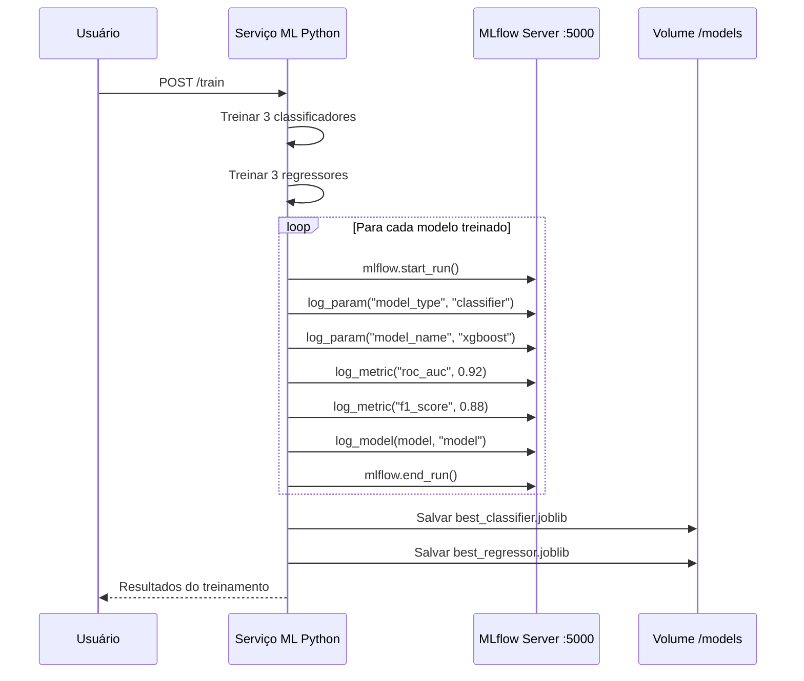
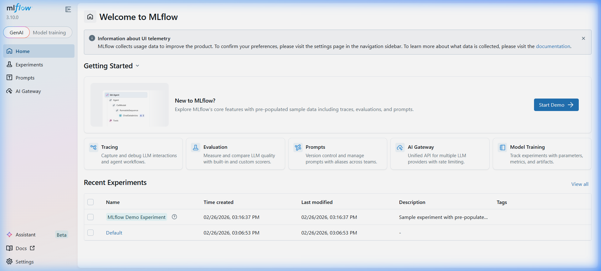
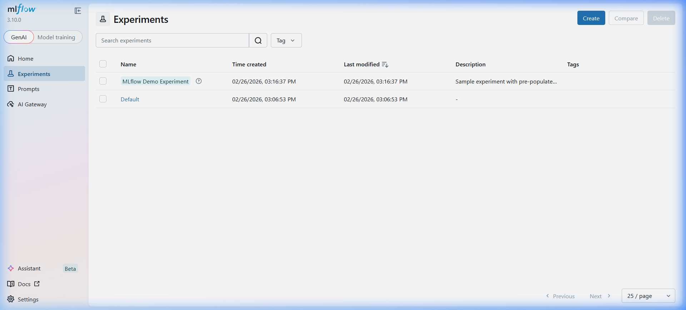
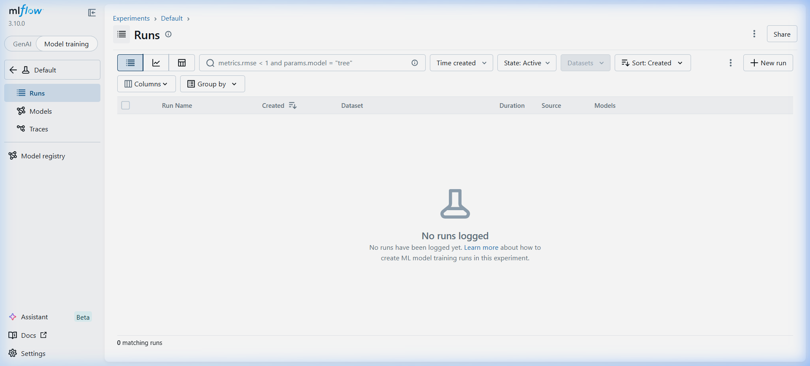

# 📊 Guia do MLflow — Predictive Log Intelligence Platform

## 1. O Que é o MLflow?

O **MLflow** é uma plataforma open-source para gerenciar o ciclo de vida completo de Machine Learning. No nosso projeto, ele atua como o **sistema de versionamento e rastreamento de modelos**, registrando:

- **Parâmetros** de cada modelo (tipo, hiperparâmetros)
- **Métricas** de avaliação (ROC-AUC, F1, RMSE, R², MAE)
- **Artefatos** (modelos serializados `.joblib`, gráficos)
- **Comparação** entre diferentes runs de treinamento

### Acessar a Interface

```
http://localhost:5000
```

> [!NOTE]
> O MLflow roda como um container Docker separado (`plip-mlflow`) e persiste dados em um volume Docker. Os dados sobrevivem a reinicializações.

---

## 2. Como o MLflow Funciona no Nosso Projeto

### Arquitetura de integração



### Onde o MLflow é chamado no código

O fluxo de treinamento em `train.py` chama o MLflow na **etapa 9**:

```python
# train.py — linha 167-172
# 9. Log to MLflow
try:
    classifier_pipeline.log_to_mlflow(settings.EXPERIMENT_NAME)
    regressor_pipeline.log_to_mlflow(settings.EXPERIMENT_NAME)
except Exception as e:
    logger.warning(f"MLflow logging failed: {e}")
```

O nome do experimento é definido em `config.py`:

```python
# config.py
EXPERIMENT_NAME: str = "predictive-log-intelligence"
```

---

## 3. Passo a Passo — Usar o MLflow na Prática

### 3.1 Pré-requisito: Garantir que o MLflow está rodando

```bash
# Verificar se o container está ativo
docker ps --filter "name=plip-mlflow"

# Resultado esperado:
# plip-mlflow   Up X minutes   0.0.0.0:5000->5000/tcp
```

Se não estiver rodando:
```bash
docker-compose up -d mlflow
```

### 3.2 Gerar dados e treinar modelos

Os modelos são registrados no MLflow **automaticamente** quando você executa o treinamento:

```bash
# 1. Gerar dataset sintético (5000 registros)
curl -X POST http://localhost:8000/generate-dataset

# 2. Treinar modelos — isso registra tudo no MLflow
curl -X POST http://localhost:8000/train
```

Após o treinamento, você verá 6 runs no MLflow (3 classificadores + 3 regressores).

### 3.3 Navegar pela Interface do MLflow

Abra http://localhost:5000 no navegador:



#### Página inicial

A tela inicial mostra:
- **Recent Experiments** — lista dos experimentos recentes
- **Getting Started** — cards com funcionalidades (Tracing, Evaluation, Model Training)
- Na sidebar: **Home**, **Experiments**, **Prompts**, **AI Gateway**

Clique em **Model Training** ou em **Experiments** na sidebar para acessar seus experimentos.

#### Lista de Experimentos



Aqui você vê todos os experimentos. O nosso projeto cria um chamado **`predictive-log-intelligence`** (definido em `config.py`). Clique nele para ver os runs.

#### Visualizar Runs



Após o treinamento, esta tabela mostrará 6 linhas:

| Run Name | Tipo | Métricas principais |
|---|---|---|
| `classifier_logistic_regression` | Classificador | ROC-AUC, F1, Accuracy |
| `classifier_random_forest` | Classificador | ROC-AUC, F1, Accuracy |
| `classifier_xgboost` | Classificador | ROC-AUC, F1, Accuracy |
| `regressor_linear_regression` | Regressor | RMSE, MAE, R² |
| `regressor_random_forest_regressor` | Regressor | RMSE, MAE, R² |
| `regressor_gradient_boosting` | Regressor | RMSE, MAE, R² |

---

## 4. O Que é Registrado em Cada Run

### 4.1 Classificadores

Para cada classificador, o método `log_to_mlflow()` em `classifier.py` registra:

```python
def log_to_mlflow(self, experiment_name: str):
    mlflow.set_tracking_uri(settings.MLFLOW_TRACKING_URI)
    mlflow.set_experiment(experiment_name)

    for name, model in self.models.items():
        with mlflow.start_run(run_name=f"classifier_{name}") as run:
            # Parâmetros
            mlflow.log_param("model_type", "classifier")
            mlflow.log_param("model_name", name)
            mlflow.log_param("is_best", name == self.best_model_name)

            # Métricas
            mlflow.log_metric("roc_auc", metrics["roc_auc"])
            mlflow.log_metric("f1_score", metrics["f1_score"])
            mlflow.log_metric("accuracy", metrics["accuracy"])

            # Artefato do modelo
            if name.startswith("xgboost"):
                mlflow.xgboost.log_model(model, artifact_path="model")
            else:
                mlflow.sklearn.log_model(model, artifact_path="model")
```

| Campo | Exemplo | Onde ver no MLflow |
|---|---|---|
| **Param**: `model_type` | `classifier` | Aba "Parameters" do run |
| **Param**: `model_name` | `xgboost` | Aba "Parameters" do run |
| **Param**: `is_best` | `True` | Aba "Parameters" do run |
| **Metric**: `roc_auc` | `0.9245` | Aba "Metrics" do run |
| **Metric**: `f1_score` | `0.8832` | Aba "Metrics" do run |
| **Metric**: `accuracy` | `0.8740` | Aba "Metrics" do run |
| **Artifact**: `model/` | Modelo serializado | Aba "Artifacts" do run |

### 4.2 Regressores

Para cada regressor, o método `log_to_mlflow()` em `regressor.py` registra:

```python
def log_to_mlflow(self, experiment_name: str):
    for name, model in self.models.items():
        with mlflow.start_run(run_name=f"regressor_{name}") as run:
            mlflow.log_param("model_type", "regressor")
            mlflow.log_param("model_name", name)
            mlflow.log_param("is_best", name == self.best_model_name)

            mlflow.log_metric("rmse", metrics["rmse"])
            mlflow.log_metric("mae", metrics["mae"])
            mlflow.log_metric("r2", metrics["r2"])

            mlflow.sklearn.log_model(model, artifact_path="model")
```

| Campo | Exemplo |
|---|---|
| **Metric**: `rmse` | `152.34` |
| **Metric**: `mae` | `98.45` |
| **Metric**: `r2` | `0.7821` |

---

## 5. Como Usar a UI do MLflow

### 5.1 Comparar modelos

1. Acesse **Experiments** → clique em **`predictive-log-intelligence`**
2. Selecione 2 ou mais runs (checkbox à esquerda)
3. Clique em **Compare** no topo
4. Veja gráficos lado a lado de parâmetros e métricas

### 5.2 Filtrar por métricas

Na barra de busca do experimento, use a sintaxe de filtro:

```
# Runs com ROC-AUC acima de 0.85
metrics.roc_auc > 0.85

# Apenas classificadores
params.model_type = "classifier"

# Apenas o melhor modelo
params.is_best = "True"

# Regressores com R² acima de 0.7
params.model_type = "regressor" and metrics.r2 > 0.7
```

### 5.3 Visualizar artefatos do modelo

1. Clique em qualquer run
2. Vá até a aba **Artifacts**
3. Você verá a pasta `model/` contendo:
   - `model.pkl` ou `model.xgb` — o modelo serializado
   - `MLmodel` — metadados do MLflow
   - `conda.yaml` / `requirements.txt` — dependências para reprodução

### 5.4 Baixar um modelo registrado

Na UI, clique no artefato e depois em **Download**. Ou via API Python:

```python
import mlflow

# Carregar modelo diretamente de um run_id
model = mlflow.sklearn.load_model("runs:/<RUN_ID>/model")

# Usar para predição
prediction = model.predict(X_new)
```

---

## 6. Como Re-treinar e Comparar

Cada vez que você executa `POST /train`, **novos runs são criados** no mesmo experimento. Isso permite:

```bash
# Treinamento 1 — dados originais
curl -X POST http://localhost:8000/train

# ... fazer mudanças nos dados ou hiperparâmetros ...

# Treinamento 2 — novos dados
curl -X POST http://localhost:8000/train

# Treinamento 3 — após ajuste de features
curl -X POST http://localhost:8000/train
```

Na UI do MLflow, você terá 18 runs (6 por treino × 3 treinos). Use **Compare** para ver a evolução das métricas ao longo dos treinos.

---

## 7. Conceitos Chave do MLflow

| Conceito | Definição | No nosso projeto |
|---|---|---|
| **Experiment** | Agrupamento lógico de runs | `predictive-log-intelligence` |
| **Run** | Uma execução de treinamento individual | `classifier_xgboost`, `regressor_gradient_boosting` |
| **Parameter** | Configuração fixa do treinamento | `model_type`, `model_name`, `is_best` |
| **Metric** | Valor numérico de avaliação | `roc_auc`, `f1_score`, `rmse`, `r2` |
| **Artifact** | Arquivo gerado (modelo, gráfico) | `model/`, gráficos PNG |
| **Tracking URI** | URL do servidor MLflow | `http://mlflow:5000` (dentro do Docker) |
| **Model Registry** | Catálogo de modelos promovidos | Disponível na sidebar "Models" |

---

## 8. Configuração no Nosso Projeto

### Variáveis de ambiente (docker-compose.yml)

```yaml
python-ml:
  environment:
    MLFLOW_TRACKING_URI: "http://mlflow:5000"   # URL interna Docker
    MODELS_DIR: "/app/models"                    # Onde salvar .joblib

mlflow:
  environment:
    MLFLOW_TRACKING_URI: "sqlite:///mlflow/mlflow.db"  # Backend do MLflow
  ports:
    - "5000:5000"                                # Porta exposta
  volumes:
    - mlflow_data:/mlflow                        # Persistência
    - ./models:/models                           # Artefatos compartilhados
```

### Configuração Python (config.py)

```python
class Settings:
    MLFLOW_TRACKING_URI: str = os.getenv(
        "MLFLOW_TRACKING_URI", "http://localhost:5000"
    )
    EXPERIMENT_NAME: str = "predictive-log-intelligence"
```

---

## 9. Dicas e Boas Práticas

> [!TIP]
> **Adicione tags descritivas** aos runs para facilitar buscas futuras. Você pode fazer isso via `mlflow.set_tag("dataset_version", "v1")` no código de treinamento.

> [!TIP]
> **Use o Model Registry** para promover modelos de "Staging" → "Production". Clique em um run → "Register Model" → Defina estágio (Staging/Production).

> [!IMPORTANT]
> O MLflow armazena dados no volume Docker `mlflow_data`. Se você executar `docker-compose down -v`, **todos os runs serão perdidos**. Use `docker-compose down` (sem `-v`) para preservar os dados.

> [!WARNING]
> Se o MLflow estiver indisponível durante o treinamento, o código captura a exceção silenciosamente e continua. Os modelos são treinados e salvos normalmente — apenas o registro no MLflow é pulado.

---

## 10. Referência Rápida de Comandos

```bash
# === Verificar MLflow ===
docker ps --filter "name=plip-mlflow"           # Container rodando?
curl http://localhost:5000                        # API respondendo?

# === Treinar e registrar ===
curl -X POST http://localhost:8000/generate-dataset  # Gerar dados
curl -X POST http://localhost:8000/train             # Treinar + registrar no MLflow

# === Logs do container ===
docker logs plip-mlflow --tail 20                # Últimas 20 linhas

# === Reiniciar MLflow ===
docker-compose restart mlflow

# === Limpar tudo (CUIDADO: perde dados!) ===
docker-compose down -v                           # Remove volumes
docker-compose up -d                             # Recria do zero
```
