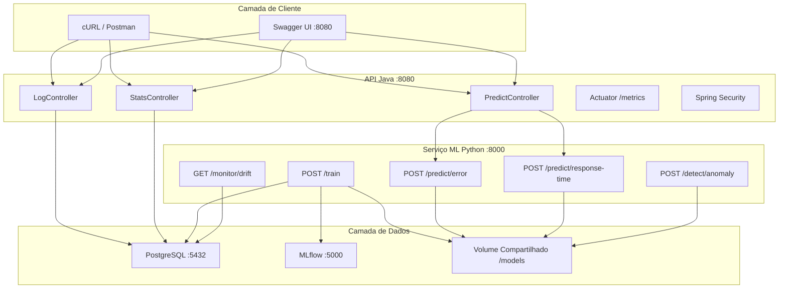
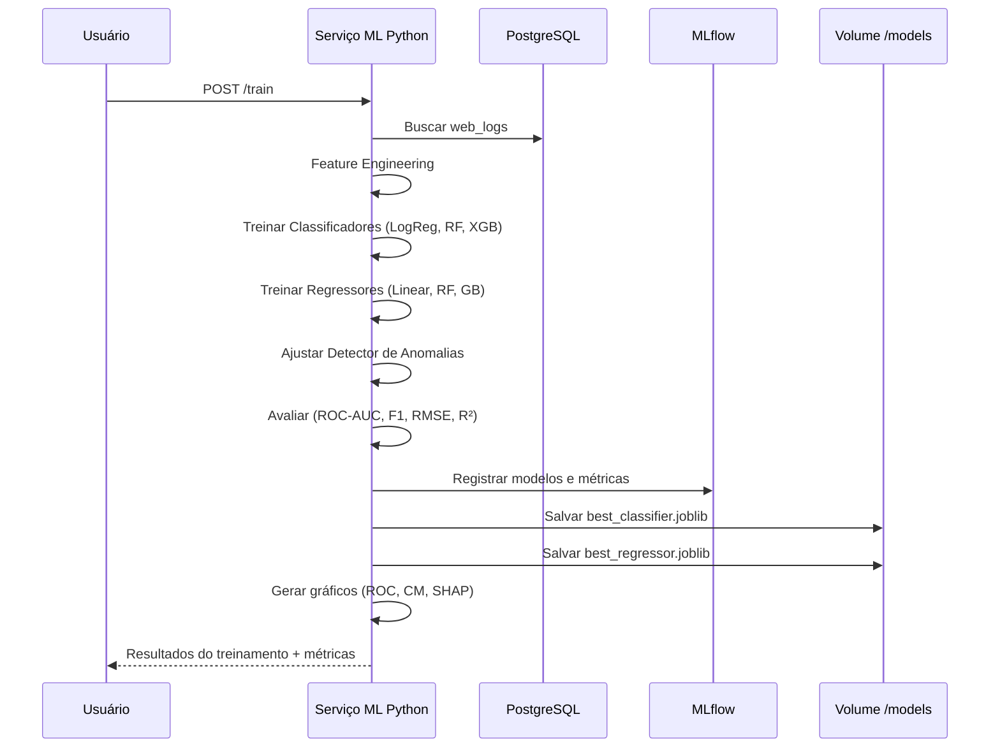
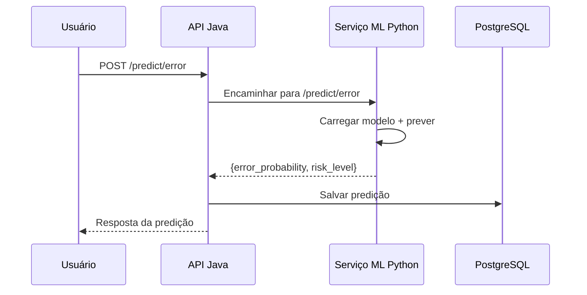

# 🔮 Predictive Log Intelligence Platform

> Plataforma distribuída de nível enterprise para ingestão de logs web, análise estatística e detecção preditiva de anomalias usando Machine Learning.

---

## 📐 Arquitetura



---

## 🧠 Fluxo de Treinamento



---

## 🔍 Fluxo de Inferência



---

## 🚀 Início Rápido

### Pré-requisitos
- Docker & Docker Compose
- (Opcional) Java 21 + Maven para desenvolvimento local da API Java
- (Opcional) Python 3.12 para desenvolvimento local do serviço ML

### Executar com Docker Compose

```bash
# Navegar até o projeto
cd predictive-log-platform

# Iniciar todos os serviços
docker-compose up --build -d

# Verificar saúde dos serviços
docker-compose ps
```

**Serviços disponíveis:**
| Serviço | URL | Descrição |
|---------|-----|-----------|
| API Java | http://localhost:8080 | API REST para logs, estatísticas e predições |
| Swagger UI | http://localhost:8080/swagger-ui.html | Documentação interativa da API |
| Serviço ML Python | http://localhost:8000/docs | Documentação FastAPI do serviço ML |
| MLflow | http://localhost:5000 | Interface de rastreamento de modelos |
| PostgreSQL | localhost:5432 | Banco de dados |

### Configuração Inicial (após os containers estarem rodando)

```bash
# 1. Gerar dataset sintético (5000 registros)
curl -X POST http://localhost:8000/generate-dataset

# 2. Treinar modelos de ML
curl -X POST http://localhost:8000/train

# 3. Fazer upload do CSV para a API Java
curl -F "file=@data/web_logs.csv" http://localhost:8080/logs/upload

# 4. Consultar estatísticas
curl http://localhost:8080/stats/summary | python -m json.tool
```

---

## 📡 Referência da API

### API Java (porta 8080)

#### Upload de Logs
```bash
curl -X POST http://localhost:8080/logs/upload \
  -F "file=@data/web_logs.csv"
```

#### Consultar Estatísticas
```bash
curl http://localhost:8080/stats/summary
```
Resposta:
```json
{
  "totalRecords": 5000,
  "meanResponseTime": 285.5,
  "medianResponseTime": 220.0,
  "stdDevResponseTime": 180.3,
  "percentile95ResponseTime": 750.0,
  "errorRate": 0.14,
  "peakHour": 10,
  "peakHourCount": 350
}
```

#### Prever Probabilidade de Erro
```bash
curl -X POST http://localhost:8080/predict/error \
  -H "Content-Type: application/json" \
  -d '{"method":"GET","hour":14,"historicalAvgResponse":240}'
```
Resposta:
```json
{
  "error_probability": 0.27,
  "risk_level": "MEDIUM",
  "model_used": "xgboost",
  "inference_time_ms": 5.2
}
```

#### Prever Tempo de Resposta
```bash
curl -X POST http://localhost:8080/predict/response-time \
  -H "Content-Type: application/json" \
  -d '{"method":"POST","hour":10,"historicalAvgResponse":300}'
```
Resposta:
```json
{
  "predicted_response_time_ms": 285.5,
  "confidence_interval": {
    "lower_bound_ms": 120.0,
    "upper_bound_ms": 450.0,
    "confidence_level": 0.95
  }
}
```

### Serviço ML Python (porta 8000)

#### Treinar Modelos
```bash
curl -X POST http://localhost:8000/train
```

#### Detectar Anomalia
```bash
curl -X POST http://localhost:8000/detect/anomaly \
  -H "Content-Type: application/json" \
  -d '{"response_time_ms":15000,"method":"GET","hour":3}'
```
Resposta:
```json
{
  "is_anomaly": true,
  "score": -0.78,
  "details": {
    "z_score": {"value": 4.5, "is_anomaly": true, "threshold": 3.0},
    "isolation_forest": {"score": -0.65, "is_anomaly": true}
  }
}
```

#### Verificar Drift de Dados
```bash
curl http://localhost:8000/monitor/drift
```

#### Saúde do Modelo
```bash
curl http://localhost:8000/monitor/health
```

### Métricas do Actuator
```bash
curl http://localhost:8080/actuator/health
curl http://localhost:8080/actuator/metrics/ml.inference.latency
curl http://localhost:8080/actuator/metrics/ml.predictions.total
```

---

## 🧪 Testes

### Testes Python
```bash
cd python-ml-service
pip install -r requirements.txt
python -m pytest tests/ -v --tb=short
```

### Testes Java
```bash
cd java-api
mvn test
```

### Relatório de Cobertura (Java)
```bash
cd java-api
mvn test jacoco:report
# Relatório em target/site/jacoco/index.html
```

---

## 📁 Estrutura do Projeto

```
predictive-log-platform/
├── docker-compose.yml
├── README.md
├── data/                          # Volume compartilhado de dados
├── models/                        # Volume compartilhado de modelos
├── postgres/
│   └── init.sql                   # Schema do banco de dados
├── mlflow/
│   └── Dockerfile
├── python-ml-service/
│   ├── Dockerfile
│   ├── requirements.txt
│   ├── app/
│   │   ├── main.py                # Aplicação FastAPI
│   │   ├── config.py              # Configurações
│   │   ├── dataset_generator.py   # Dados sintéticos (5000 registros)
│   │   ├── feature_engineering.py # Pipeline de features
│   │   ├── models/
│   │   │   ├── classifier.py      # LogReg, RF, XGBoost
│   │   │   ├── regressor.py       # Linear, RF, GradientBoosting
│   │   │   └── anomaly.py         # Z-score + Isolation Forest
│   │   ├── monitoring/
│   │   │   └── drift.py           # Drift com Evidently AI
│   │   ├── visualization/
│   │   │   └── plots.py           # ROC, CM, SHAP, Feature Imp.
│   │   └── routers/
│   │       ├── train.py           # POST /train
│   │       ├── predict.py         # POST /predict/*
│   │       ├── anomaly.py         # POST /detect/anomaly
│   │       └── monitor.py         # GET /monitor/drift
│   └── tests/
│       ├── test_pipeline.py       # Testes unitários
│       ├── test_predict.py        # Testes de endpoints
│       └── test_anomaly.py        # Testes de anomalia
└── java-api/
    ├── Dockerfile
    ├── pom.xml
    └── src/
        ├── main/
        │   ├── java/com/logplatform/
        │   │   ├── LogPlatformApplication.java
        │   │   ├── entity/         # WebLog, Prediction
        │   │   ├── repository/     # Repositórios JPA
        │   │   ├── service/        # Lógica de negócio
        │   │   ├── controller/     # Controladores REST
        │   │   ├── dto/            # DTOs de Request/Response
        │   │   └── config/         # Security, WebClient, Métricas
        │   └── resources/
        │       └── application.yml
        └── test/
            ├── java/com/logplatform/
            │   ├── controller/     # Testes com MockMvc
            │   └── IntegrationTest.java
            └── resources/
                └── application.yml
```

---

## 🤖 Modelos de ML

### Classificação (Predição de Erro)
| Modelo | Alvo | Métricas |
|--------|------|----------|
| Regressão Logística | `is_error` (status ≥ 400) | ROC-AUC, F1, Precision-Recall |
| Random Forest | `is_error` | ROC-AUC, F1, Precision-Recall |
| **XGBoost** | `is_error` | ROC-AUC, F1, Precision-Recall |

### Regressão (Tempo de Resposta)
| Modelo | Alvo | Métricas |
|--------|------|----------|
| Regressão Linear | `response_time_ms` | RMSE, MAE, R² |
| Random Forest Regressor | `response_time_ms` | RMSE, MAE, R² |
| **Gradient Boosting** | `response_time_ms` | RMSE, MAE, R² |

### Feature Engineering
- Hora do dia, Dia da semana, Flag de horário comercial
- Encoding one-hot do método HTTP
- Média móvel do tempo de resposta (janela=50)
- Frequência acumulada por hora

### Gráficos Gerados
- `roc_curve.png` — Curvas ROC de todos os classificadores
- `confusion_matrix.png` — Matriz de confusão do melhor classificador
- `feature_importance.png` — Importância das features (gráfico de barras)
- `shap_values.png` — Gráfico de explicabilidade SHAP

---

## 📊 Monitoramento

- **Métricas Actuator**: `/actuator/metrics` (latência, volume de predições, taxa de erro)
- **Prometheus**: `/actuator/prometheus`
- **Drift de dados**: `GET /monitor/drift` (relatórios Evidently AI)
- **Saúde do modelo**: `GET /monitor/health`
- **MLflow UI**: http://localhost:5000 (versionamento de modelos, rastreamento de experimentos)

---

## 📜 Licença

Licença MIT
