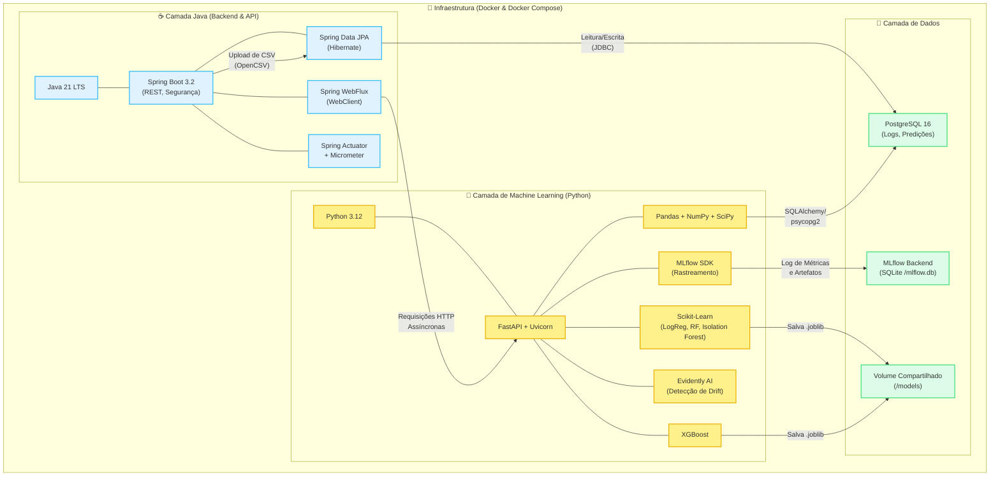

# 📚 Dicionário de Tecnologias — Predictive Log Intelligence Platform

Este documento explica **o que é** cada tecnologia utilizada na plataforma e **como ela atua** especificamente no nosso projeto. As tecnologias estão divididas por camada da arquitetura.

## 🗺️ Diagrama da Stack Tecnológica

---

## 1. 🐍 Ecossistema de Machine Learning (Python)

Esta camada é responsável por treinar os modelos, gerar predições e detectar anomalias.

### 1.1 Python 3.12 (Linguagem)
* **Teoria:** Uma das linguagens de programação mais populares do mundo, amplamente adotada em ciência de dados e IA devido à sua vasta biblioteca de pacotes estatísticos e de machine learning.
* **No nosso projeto:** É o motor principal para processar os logs (`pandas`), transformar features e treinar os modelos inteligentes que "aprendem" os padrões do sistema.

### 1.2 FastAPI & Uvicorn (Framework API)
* **Teoria:** O FastAPI é um framework web moderno e de alta performance para a construção de APIs com Python baseado em rotinas assíncronas (asyncio). Uvicorn é o servidor web ultrarrápido (ASGI) que executa o código FastAPI.
* **No nosso projeto:** Expõe os endpoints (`/train`, `/predict/error`, `/detect/anomaly`) na porta 8000 para que a API Java possa consumir os modelos treinados. Foi escolhido pela sua capacidade de lidar de forma robusta e paralela com inferências simultâneas de modelos.

### 1.3 Scikit-Learn (Machine Learning)
* **Teoria:** A biblioteca padrão-ouro na comunidade Python para algoritmos clássicos de machine learning, pré-processamento de dados e avaliação de modelos.
* **No nosso projeto:** Utilizada para construir os modelos base:
  * **Logistic Regression:** Fornece um baseline simples para classificar erros.
  * **Random Forest (Classifier/Regressor):** Modelos de ensemble que treinam diversas árvores de decisão.
  * **Isolation Forest:** Usado para detectar anomalias dividindo aleatoriamente os dados.
  * **Métricas:** Calcula o ROC-AUC, F1-score e Confusion Matrix para saber qual modelo foi melhor.

### 1.4 XGBoost (Gradient Boosting)
* **Teoria:** Extreme Gradient Boosting. Uma biblioteca otimizada que constrói algoritmos de árvores de decisão em sequência, onde cada árvore tenta corrigir os erros da árvore anterior, resultando em precisão altíssima e vitórias em competições do Kaggle.
* **No nosso projeto:** É o nosso modelo "peso-pesado" para classificação da probabilidade de erro HTTP. Foca nos registros mais difíceis de classificar (como logs que estão na fronteira entre sucesso e falha) e tipicamente é selecionado como o melhor modelo.

### 1.5 Pandas & NumPy (Data DataFrames e Matemática)
* **Teoria:** Pandas é utilizado para manipulação e análise de dados tabulares (com sua estrutura primária `DataFrame`). O NumPy fornece arrays multidimensionais altamente otimizados em linguagem C.
* **No nosso projeto:**
  * O Pandas carrega os arquivos CSV em memória, cria novas colunas (ex: extrai a hora do log, codiffica se o método HTTP era POST) e repassa essa tabela formatada para o ML.
  * O NumPy acelera os cálculos para transformar os logs em Z-scores no detector de anomalias.

### 1.6 SciPy (Estatística)
* **Teoria:** Biblioteca para matemática científica e computação técnica usando cálculos fundamentados.
* **No nosso projeto:** Utilizamos as funções estatísticas avançadas (como `scipy.stats.ks_2samp`) como plano de fallback no cálculo do drift de dados, aplicando o teste Kolmogorov-Smirnov.

### 1.7 MLflow (Governança de IA)
* **Teoria:** Plataforma para tracking de experimentos, registro do código do experimento, versão do modelo e dos dados utilizados. Organiza a experimentação iterativa em Ciência de Dados.
* **No nosso projeto:** Toda vez que um script treina os modelos, as métricas e hiperparâmetros são guardadas no servidor MLflow (porta 5000). Ele nos diz: *“O treinamento de hoje teve ROC-AUC 92%, melhor do que o de ontem (88%)"*. Ele guarda um backup digital (artefato .joblib) do modelo.

### 1.8 Evidently AI (Monitoramento)
* **Teoria:** Ferramenta open-source para avaliação, testagem e monitoramento de qualidade dos dados de ML em produção (focada em detectar *data drift*).
* **No nosso projeto:** Compara o padrão estatístico dos logs no dia de hoje contra o padrão de quando o modelo foi treinado. Se houver desvio (ex: o tempo de resposta geral subiu 300ms na média no banco), ele avisa que os dados envelheceram e o modelo precisa ser retreinado (`/monitor/drift`).

### 1.9 Joblib (Serialização)
* **Teoria:** Biblioteca desenhada especialmente para transformar objetos (como pesados arrays NumPy e modelos de ML) do Python em arquivos salvos no disco (`.joblib`).
* **No nosso projeto:** Assim que a predição é otimizada, o modelo vitorioso de dezenas de megabytes é salvo na pasta `/models` (ex: `best_classifier.joblib`). Quando uma requisição de inferência entra pelo FastAPI, este arquivo é lido da memória, devolvendo um veredito em milissegundos.

---

## 2. ☕ Ecossistema Back-end (Java API)

Esta camada funciona como o Hub central, processando o fluxo intenso dos uploads de log, respondendo requisições com métricas agregadas e agindo como ponte de comunicação com a Inteligência Artificial.

### 2.1 Java 21 LTS (Linguagem)
* **Teoria:** É uma versão de longo suporte de uma das linguagens de missão crítica mais seguras e consolidadas no universo enterprise, contendo features massivas como Pattern Matching, Virtual Threads (Projeto Loom) e robustez incomparável em Garbage Colletion.
* **No nosso projeto:** Dá toda a estabilidade para a API base e suporta altas cargas ao executar pesadas operações transacionais JPA de banco de dados no momento da importação dos CSVs.

### 2.2 Spring Boot 3.2.x (Microframework)
* **Teoria:** Automatiza toda a suíte de tecnologias integradas do clássico "Spring", cortando o excessivo boilerplate das decádas de 2010 e transformando um gigante servidor rodando num único e leve JAR executável (com Tomcat embutido).
* **No nosso projeto:** É a espinha dorsal de todo o código da porta 8080 (`Application.java`). Facilita a modelagem em Controllers, Services e Repositories aplicando injeção automática de dependências (Inversion of Control).

### 2.3 Spring Data JPA & Hibernate 6 (ORM)
* **Teoria:** Mapeamento de persistência de banco de dados Objeto Relacional (Object Relational Mapping) construído seguindo os padrões JPA.
* **No nosso projeto:** Ao receber um log web para o BD, você trabalha exclusivamente com objetos em código Java (ex: Entity `WebLog`). O Hibernate se encarrega de reescrever automaticamente isso para `INSERT INTO web_logs...` do Postgre, simplificando os CRUDs pela interface de repositórios (ex: os cálculos de frequência na interface `WebLogRepository`).

### 2.4 Spring Security
* **Teoria:** Engine para autenticação, autorização de acesso e seguridade global contra acessos vulneráveis no framework Spring.
* **No nosso projeto:** Foi configurado como *Stateless* para garantir proteções de alto nível (ex: CORS) no arquivo `SecurityConfig.java`, ao passo em que permite o acesso sem credenciais de autenticação (liberados APIs de monitoramento/Swagger/Logs) por enquanto para os estágios atuais de desenvolvimento.

### 2.5 WebFlux / WebClient (Cliente HTTP Reativo)
* **Teoria:** Biblioteca para web do pacote Spring pensada em alta vazão baseada em fluxos reativos e *Non-blocking I/O*.
* **No nosso projeto:** O serviço em Java precisa ligar em milissegundos ao serviço em Python para pedir as "Predições" e "Respostas" (`PredictionService.java`). O *WebClient* não bloqueia uma Thread no Java e consegue repassar a carga sem perdas ou atrasos síncronos, retornando um Mono Reativo do JSON para os usuários.

### 2.6 Spring Actuator, Micrometer & Prometheus (Observabilidade)
* **Teoria:** Actuator expõe os dados vitais da infraestrutura em que o serviço foi lançado (Status de sistema, conexões JDBC com defeito, Heap da máquina Java). O Micrometer atua como uma interface livre para coletar telemetria das máquinas e exportá-las para os servidores do formato Prometheus.
* **No nosso projeto:** Foi injetado nos "Timers e Counters" manuais dentro da chamada as predições. É exposto nas rotas seguras globais do `/actuator/metrics` onde qualquer Dashoard (Grafana, Datadog) consegue capturar em quantas vezes falhou a Inteligência artificial e os picos de tráfego.

### 2.7 OpenCSV
* **Teoria:** Simples bibliotecas utilitárias de importação de extensões para formatar Data CSV em Java baseados com Streams de entrada eficientes.
* **No nosso projeto:** Analisa as matrizes embutidas usando Streams File Upload do Multipart e recria uma lista com suporte universal nas planilhas e converte para Entities instanciáveis enviando centenas de `WebLogs` de uma única vez contra o SQL do banco.

---

## 3. 💾 Infraestrutura & Dados

### 3.1 PostgreSQL 16 (Banco Relacional Primário)
* **Teoria:** SGBD relacional de natureza Open-Source mais avançado, escalável e de nível corporativo e ACID Compliant de mercado. Foca amplamente em segurança de ponta.
* **No nosso projeto:** Retém os pesados fluxos dos registros criados (mais de 5000+ gerados nas sinteses) dividos pela estrutura gerada nos tables do `init.sql`. Salva todos os resíduos históricos previstos (`predictions`), sendo as memórias a longo prazo da ferramenta.

### 3.2 Docker (Containerização)
* **Teoria:** Ferramenta que embasa todos os serviços isolando em imagens padronizadas chamadas de Contêineres (Micro-ambientes de execução empacotadores universais baseados em Linux).
* **No nosso projeto:** Isola em compartimentos separados onde os testes da compilação Java `Maven JRE Eclipse` não se esmagam com os requisitos restritos do `Python pip`. Ele equaliza também todos os deploys no comando de uso Dockerfile independente da máquina de compilação ou do Kernel.

### 3.3 Docker Compose (Orquestração de Múltiplos Contêineres)
* **Teoria:** Facilita iniciar um grupo de container inter-relacionados (por ex, um Front, um Back e o BD) via única chamada YAML.
* **No nosso projeto:** Como a Log Plataform necessita de 4 contêineres atrelados, ele levanta pela receita programada do `docker-compose.yml`, o `plip-postgres`, o `plip-java-api`, `plip-mlflow` e o `plip-python-ml` todos de uma vez dividindo uma rede virtual customizada para se comunicarem diretamente na bridge.
